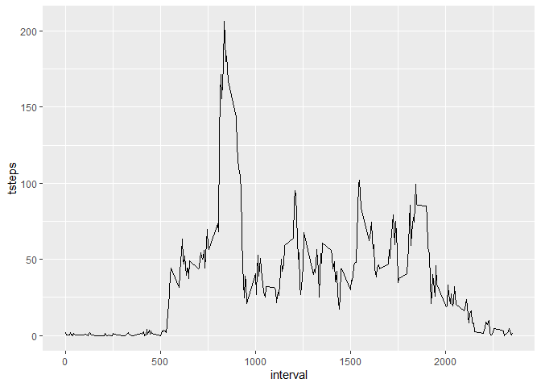

## 1.Code for reading in the dataset and/or processing the data

### Setting the Work Directory and Downloading Activity monitoring data file from the Internet

```r
setwd("C:/Users/apram/Documents/RProject/RepData_PeerAssessment1/RepData_PeerAssessment1")
getwd()
```

```
## [1] "C:/Users/apram/Documents/RProject/RepData_PeerAssessment1/RepData_PeerAssessment1"
```

### Download zip files from this location:

```r
if(!file.exists("./data")){dir.create("./data")}
fileUrl <- "https://d396qusza40orc.cloudfront.net/repdata%2Fdata%2Factivity.zip"
download.file(fileUrl,destfile="./data/activity.zip",method="curl")
```
### Unzip data file and read 

```r
unzip("activity.zip")
stepdata <- read.csv("activity.csv", header = TRUE)
head(stepdata)
```

```
##   steps       date interval
## 1    NA 2012-10-01        0
## 2    NA 2012-10-01        5
## 3    NA 2012-10-01       10
## 4    NA 2012-10-01       15
## 5    NA 2012-10-01       20
## 6    NA 2012-10-01       25
```
## 2.Histogram of the total number of steps taken each day

```r
library(magrittr)
library(dplyr)
```

```
## 
## Attaching package: 'dplyr'
```

```
## The following objects are masked from 'package:stats':
## 
##     filter, lag
```

```
## The following objects are masked from 'package:base':
## 
##     intersect, setdiff, setequal, union
```

```r
databydate <- stepdata %>% select(date, steps) %>% group_by(date) %>% summarize(tsteps= sum(steps)) %>%na.omit()
hist(databydate$tsteps, xlab = "Total daily Steps",main="Histogram of Total Steps by day")
```

<!-- -->

## 3. Calculate and report the mean and median of the total number of steps taken per day

```r
mean(databydate$tsteps)
```

```
## [1] 10766.19
```

```r
median(databydate$tsteps)
```

```
## [1] 10765
```
## 4.Time series plot of the average number of steps taken

```r
library(ggplot2)
databyinterval <- stepdata%>% select(interval, steps) %>% na.omit() %>% group_by(interval) %>% summarize(tsteps= mean(steps))
ggplot(databyinterval, aes(x=interval, y=tsteps))+ geom_line()
```

<!-- -->

###
## 5. The 5 minute interval that on average contains the maximum number of steps


```r
print(paste("Interval containing the most steps on average: ",databyinterval$interval[which.max(databyinterval$tsteps)]))
```

```
## [1] "Interval containing the most steps on average:  835"
```

```r
print(paste("Average steps for that interval: ",round(max(databyinterval$tsteps),digits=2)))
```

```
## [1] "Average steps for that interval:  206.17"
```
## 6.Code to describe and show a strategy for imputing missing data
### Calculate and report the total number of missing values in the dataset (i.e. the total number of rows with NAs)

```r
print(paste("The total number of rows with NA is: ",sum(is.na(stepdata$steps))))
```

```
## [1] "The total number of rows with NA is:  2304"
```

```r
replacewithmean <- function(x) replace(x, is.na(x), mean(x, na.rm = TRUE))
meandata <- stepdata%>% group_by(interval) %>% mutate(steps= replacewithmean(steps))
head(meandata)
```

```
## # A tibble: 6 x 3
## # Groups:   interval [6]
##    steps date       interval
##    <dbl> <chr>         <int>
## 1 1.72   2012-10-01        0
## 2 0.340  2012-10-01        5
## 3 0.132  2012-10-01       10
## 4 0.151  2012-10-01       15
## 5 0.0755 2012-10-01       20
## 6 2.09   2012-10-01       25
```

## 7.Histogram of the total number of steps taken each day after missing values are imputed

```r
FullSummedDataByDay <- aggregate(meandata$steps, by=list(meandata$date), sum)

names(FullSummedDataByDay)[1] ="date"
names(FullSummedDataByDay)[2] ="totalsteps"
head(FullSummedDataByDay,15)
```

```
##          date totalsteps
## 1  2012-10-01   10766.19
## 2  2012-10-02     126.00
## 3  2012-10-03   11352.00
## 4  2012-10-04   12116.00
## 5  2012-10-05   13294.00
## 6  2012-10-06   15420.00
## 7  2012-10-07   11015.00
## 8  2012-10-08   10766.19
## 9  2012-10-09   12811.00
## 10 2012-10-10    9900.00
## 11 2012-10-11   10304.00
## 12 2012-10-12   17382.00
## 13 2012-10-13   12426.00
## 14 2012-10-14   15098.00
## 15 2012-10-15   10139.00
```

```r
### Summary of new data : mean & median
summary(FullSummedDataByDay)
```

```
##      date             totalsteps   
##  Length:61          Min.   :   41  
##  Class :character   1st Qu.: 9819  
##  Mode  :character   Median :10766  
##                     Mean   :10766  
##                     3rd Qu.:12811  
##                     Max.   :21194
```

```r
### Making a histogram
hist(FullSummedDataByDay$totalsteps, xlab = "Steps", ylab = "Frequency", main = "Total Daily Steps")
```

<!-- -->


```r
oldmean <- mean(databydate$tsteps, na.rm = TRUE)
newmean <- mean(FullSummedDataByDay$totalsteps)

print(paste("The total number of rows with NA is: ",round(max(oldmean),digits=2)))
```

```
## [1] "The total number of rows with NA is:  10766.19"
```

```r
print(paste("The total number of rows with NA is: ",round(max(newmean),digits=2)))
```

```
## [1] "The total number of rows with NA is:  10766.19"
```

```r
oldmedian <- median(databydate$tsteps, na.rm = TRUE)
newmedian <- median(FullSummedDataByDay$totalsteps)

print(paste("The total number of rows with NA is: ",round(max(oldmedian),digits=2)))
```

```
## [1] "The total number of rows with NA is:  10765"
```

```r
print(paste("The total number of rows with NA is: ",round(max(newmedian),digits=2)))
```

```
## [1] "The total number of rows with NA is:  10766.19"
```
## 8.Panel plot comparing the average number of steps taken per 5-minute interval across weekdays and weekends

```r
meandata$date <- as.Date(meandata$date)
meandata$weekday <- weekdays(meandata$date)
meandata$weekend <- ifelse(meandata$weekday=="Saturday" | meandata$weekday=="Sunday", "Weekend", "Weekday" )
library(ggplot2)
meandataweekendweekday <- aggregate(meandata$steps , by= list(meandata$weekend, meandata$interval), na.omit(mean))
names(meandataweekendweekday) <- c("weekend", "interval", "steps")

ggplot(meandataweekendweekday, aes(x=interval, y=steps, color=weekend)) + geom_line()+
        facet_grid(weekend ~.) + xlab("Interval") + ylab("Mean of Steps") +
        ggtitle("Comparison of Average Number of Steps in Each Interval") 
```

<!-- -->

```r
### Copy my plot to a PNG file
dev.copy(png, file = "Plot1.png", width=600, height=600)
```

```
## png 
##   3
```

```r
### Don't forget to close the PNG device!
dev.off()
```

```
## png 
##   2
```
